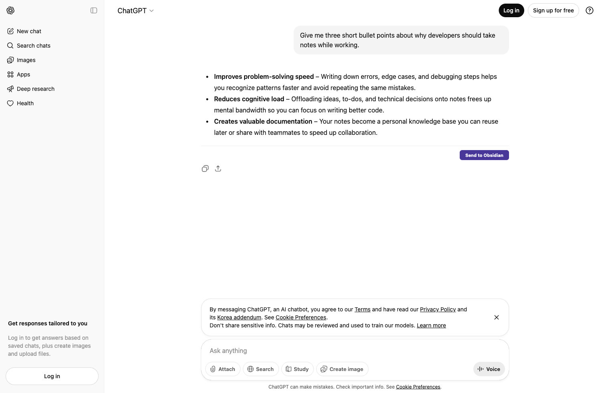

  

# AIChat-to-Notes
A Chrome extension that exports responses from web AIs into your notes.

- Web AI: **ChatGPT** (best supported right now)
- Notes: **Obsidian** (formatting work-in-progress)

## Motivation

Have you ever found yourself constantly copying and pasting responses from Gemini (Google AI) into your personal notes, only to be frustrated by the tedious process and broken formatting? This script was born out of that very frustration. Manually transferring information from the web to Obsidian (and eventually Notion), especially when dealing with rich content like tables or code blocks, is not only time-consuming but often results in a loss of valuable formatting. This project aims to streamline that workflow, ensuring your AI-generated insights are seamlessly integrated into your knowledge base.

## Features

- **One-click export button** under assistant responses (currently Obsidian export button is enabled)
- **Preserves Markdown structure** as much as possible (headings, lists, code, math, links, quotes, basic tables)
- **No separate AI API billing**: works off the web UI you already use
- **Note title modes**:
  - Auto (platform + time)
  - Prompt (manual)
  - Local LLM (LM Studio) title generation (optional)

> Notion UI/actions are intentionally hidden for now while we validate Obsidian formatting end-to-end.

> [!NOTE]
> **Disclaimer**: This tool was built to address specific formatting challenges I encountered, particularly with **math formulas** and **bold text**. While I have strived to solve these problems, please note that there may still be unresolved issues or edge cases.

## Installation (Chrome Extension)

1. Open Chrome Extensions page: `chrome://extensions`.
2. Enable **Developer mode**.
3. Click **Load unpacked**.
4. Select the `chrome-extension` folder in this repository.

## Configuration

Click the extension icon and open settings:

- **Obsidian Local REST API URL**
  - Example: `http://127.0.0.1:27123` (the extension will append `/vault` if needed)
- **Obsidian API Key**
  - Stored in Chrome local storage
- **Note Title Mode** (Auto / Prompt / Local LLM)
- *(Optional)* **LM Studio Base URL / Model** if you use the Local LLM title mode

### Important Note: Local HTTP

> [!WARNING]
> Obsidian Local REST API is typically local HTTP (`http://127.0.0.1:27123`). Requests are performed by the extension background service worker.

## Usage

1. Open **ChatGPT** (currently best supported): <https://chatgpt.com/>
2. Ask a question / open a conversation.
3. Under each assistant response, click **Send to Obsidian**.
4. Choose/confirm the note title (depends on your Title Mode).
5. The extension writes a Markdown file to your Obsidian vault via the Local REST API.

---

*This project was created with the help of **Gemini**.*

## License

MIT License
